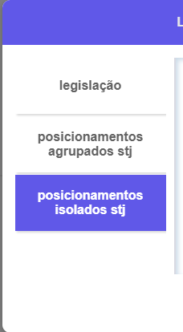

Como Configurar o AILA
----------------------

O AILA funciona atravez de um plug-in para o google chrome, para configuralo basta carregar no seu navegador, para isso siga os seguintes passos

não se esqueça de selecionar o botão para fixar a extensão na sua barra de tarefas do seu navegdor

tendo feito isso a extensão devera aparecer fixada no canto superior facilitando seu acesso

agora basta clicar nela e clicar em iniciar para poder utilizar a extensão

Como Usar o AILA
----------------

O AILA funciona atravez de um plug-in para o google chrome, para configuralo basta carregar no seu navegador, para isso siga os seguintes passos

Apos configurar o pluguin, para começar a utiliza-lo, basta clicar no botão de iniciar(no canto inferior esquerdo)

apos iniciar no canto superior direito da pagina ira aparecer o botão que abre a aba de consultas

esse é a aba de consultas quando uma legislação ou um dispositivo for detectado na padronização mais adequada ela ira aparecer nessa aba, como nesse exemplo o CC (Codigo Civil)

ainda na aba lateral de consultas ao clicar em um dos itens ira abrir um pop-up mostrando mais informações sobre o elemento desejado

nesse exemplo a aba lateral esta mostrando a legislação da lei 10406 pareada com o artigo quarto, quando o poup-abre normalmente ele exibe o texto inicial referente a legislação ou ao dispositivo, para fechar essa aba de pop-up clique no botão direito superior onde tem "x", ou precione a tecla "esc" no seu teclado

observe essa barra lateral no pop-up, nela você pode navegar e examinar melhor os elementos da consulta

nesse casoao clicar em posicionamento agrupados do stj, ele expande e abre uma lista com todas as jurisprudencias encontradas que correspondem aos posicionamentos agrupados

ao clicar em uma jurisprudencia ele vai alterar o conteudo da janela de visualização com o conteudo da jurisprudencia, o botão no canto inferior direito copia o texto que esta sendo exibido na janela de visualização, nesse caso essa jurisprudencia especifica, o texto fica na area de tranferencia do seu computador, ou seja basta apertar CTRL + V ou clicar com botão direito do mouse e na opção colar, para colar o texto aonde quiser

ainda na aba lateral também é possivel visualizar os posicionamentos isolados da mesma forma dos agrupados

quando a peticão estiver sendo escrita caso o plugin estaja ativado, ele ira marcar padroes de citações que ele detectou e que as considere não tão indicadas, essas ficarao sublinhadas em na cor salmão

ao passar o mause por cima essas citações marcadas ficaram destacadas

ao clicar em cima dessas marcações se abrira um pop-up de sugestão, para fechalo e ignorar a sugestão feita pela ferramenta basta clicar no "x" no canto superior direito do pop-up, ao clicar na sugestao ele ira substituir a citação pela forma que ele identificou como mais adequada

aqui um exemplo do texto apos substituido

 

Sobre o AILA
------------

AILA foi um projeto desenvolvido pela UNIFOR(Universidade de Fortaleza), mais especificamente pelo NCDIA(nucleo de ciencia de dados e inteligencia artificial) da UNIFOR, o projeto visa trazer uma revolução na aréa juridica, AILA e só uma parte de um projeto maior que envolve ciencia de dados e inteligencia artificial, a UNIFOR vem trabalhando e desenvolvendo pesquisas na area da Justiça 4.0, uma analogia ao termo industria 4.0, ............

Mais Sobre A UNIFOR
-------------------

Criada em 1973, fundada pelo Grupo Edson Queiroz, por iniciativa do próprio Edson Queiroz, é rankeada, hoje, como a melhor universidade privada do norte e nordeste do Brasil. A UNIFOR conta, atualmente, com 40 cursos na área de Graduação. Na área de Pós-Graduação a Universidade oferece seis cursos de Mestrado (Administração, Ciências Médicas, Direito Constitucional, Informática Aplicada, Psicologia, Saúde Coletiva) e cinco cursos de Doutorado (Direito, Administração,Informática, Psicologia e Biotecnologia). Oferece ainda dezenas de cursos de Especialização.

About More

Mais Sobre o NCDIA
------------------

o Melhor Laboratorio do Mundo, os Outros não tem chance

  
  

### Equipe que participou do projeto

*   asdas
*   asdas
*   asdas
*   asdas
*   asdas
*   asdas
*   asdas
*   asdas
*   asdas
*   asdas