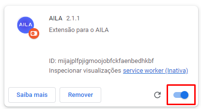
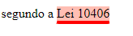
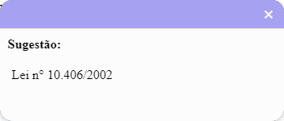

      

         

            

               

                  

                     
                  

               

            

         

      

      

         

            

               

                  

                     <h2>Como Configurar o AILA</h2>
                     
O AILA funciona atravez de um plug-in para o google chrome, para configuralo basta carregar no seu navegador, para isso siga os seguintes passos
                     

                     <video width="90%" height="auto" controls>
                        <source src="./video/como-configurar.mp4" type="video/mp4">
                        Your browser does not support the video tag.
                      </video>
                     <!-- 

                        
ao abrir o chrome no canto superior direito clique no botão de extensões

                        
                        
apos isso clique no botão gerenciar de extensões

                        
                        
ao abrir a aba de gerenciar extensões clique em carregar sem compactação, ele ira abrir o explorador de 
                           arquivos nele você deve selecionar a pasta aonde se encontra o arquivo do AILA, aposisso ele devera carregar a extensão para a aba de gerennciar extensões

                        
                        
verifique se a extensão foi carregada corretamente, casso isso ocorra ela devera aparecer dessa forma

                        
                        
Verrifique também se a extensão está habilitada no seu navegador google chrome

                        
                        
apos concluir esses passos clique novamente no botão de extensões no canto superior direiro, agora devera aparecer a extensão nele

                        
                        
não se esqueça de selecionar o botão para fixar a extensão na sua barra de tarefas do seu navegdor

                        
                        
tendo feito isso a extensão devera aparecer fixada no canto superior facilitando seu acesso

                        
                        
agora basta clicar nela e clicar em iniciar para poder utilizar a extensão

                        
                     
 -->
                     

                        
não se esqueça de selecionar o botão para fixar a extensão na sua barra de tarefas do seu navegdor

                        
                        
tendo feito isso a extensão devera aparecer fixada no canto superior facilitando seu acesso

                        
                        
agora basta clicar nela e clicar em iniciar para poder utilizar a extensão

                        
                     

                  

               

            

         

      

      

         

            

               

                  

                     <h2>Como Usar o AILA</h2>
                     
O AILA funciona atravez de um plug-in para o google chrome, para configuralo basta carregar no seu navegador, para isso siga os seguintes passos
                     

                     

                        
Apos configurar o pluguin, para começar a utiliza-lo,
                           basta clicar no botão de iniciar(no canto inferior esquerdo)  

                        
                        
apos iniciar no canto superior direito da pagina ira aparecer o botão que abre a aba de consultas

                        
                        
esse é a aba de consultas quando uma legislação ou um dispositivo for detectado na padronização mais adequada
                            ela ira aparecer nessa aba, como nesse exemplo o CC (Codigo Civil)
                        

                        
                        
ainda na aba lateral de consultas ao clicar em um dos itens ira abrir um pop-up mostrando mais informações sobre o elemento desejado

                        
                        
nesse exemplo a aba lateral esta mostrando a legislação da lei 10406 pareada com o artigo quarto, quando o poup-abre normalmente ele exibe o texto inicial 
                           referente a legislação ou ao dispositivo, para fechar essa aba de pop-up clique no botão direito superior onde tem "x", ou precione a tecla "esc" no seu teclado 

                        
                        
observe essa barra lateral no pop-up, nela você pode navegar e examinar melhor os elementos da consulta                           
                        

                        
                        
nesse casoao clicar em posicionamento agrupados do stj, ele expande e abre uma lista com todas as jurisprudencias encontradas que correspondem aos posicionamentos agrupados

                        
                        
ao clicar em uma jurisprudencia ele vai alterar o conteudo da janela de visualização com o conteudo da jurisprudencia, o botão no canto inferior direito copia o texto 
                           que esta sendo exibido na janela de visualização, nesse caso essa jurisprudencia especifica, o texto fica na area de tranferencia do seu computador, ou seja basta apertar CTRL + V ou 
                           clicar com botão direito do mouse e na opção colar, para colar o texto aonde quiser 

                        
                        
ainda na aba lateral também é possivel visualizar os posicionamentos isolados da mesma forma dos agrupados

                        
                        
quando a peticão estiver sendo escrita caso o plugin estaja ativado, ele ira marcar padroes de citações que 
                           ele detectou e que as considere não tão indicadas, essas ficarao sublinhadas em na cor salmão

                        
                        
ao passar o mause por cima essas citações marcadas ficaram destacadas

                        
                        
ao clicar em cima dessas marcações se abrira um pop-up de sugestão, para fechalo e ignorar a sugestão feita pela ferramenta basta clicar no "x" no canto superior direito do pop-up, 
                           ao clicar na sugestao ele ira substituir a citação pela forma que ele identificou como mais adequada
                        

                        
                        
aqui um exemplo do texto apos substituido

                        
                     
                        <!--        -->
                       
                     

                     

                  

               

            

         

      

            <!-- end about -->
     <!-- coronata -->
      
         
         

            

               

                  

                     <h2>Sobre o AILA</h2>
                     

                        AILA foi um projeto desenvolvido pela UNIFOR(Universidade de Fortaleza), mais especificamente pelo NCDIA(nucleo de ciencia de dados e inteligencia artificial) da UNIFOR,
                        o projeto visa trazer uma revolução na aréa juridica, AILA e só uma parte de um projeto maior que envolve ciencia de dados e inteligencia artificial, a UNIFOR 
                        vem trabalhando e desenvolvendo pesquisas na area da Justiça 4.0, uma analogia ao termo industria 4.0, ............
                     

                  

               

            

            

               

                  

                     <figure></figure>
                  

               

               

                  

                     <h2>Mais Sobre A UNIFOR</h2>
                     
Criada em 1973, fundada pelo Grupo Edson Queiroz, por iniciativa do próprio Edson Queiroz, é rankeada, hoje, como a melhor universidade privada do norte e nordeste do Brasil.
                        A UNIFOR conta, atualmente, com 40 cursos na área de Graduação. Na área de Pós-Graduação a Universidade oferece seis cursos de Mestrado (Administração, Ciências Médicas, Direito Constitucional, Informática Aplicada, Psicologia, Saúde Coletiva) e cinco cursos de 
                        Doutorado (Direito, Administração,Informática, Psicologia e Biotecnologia). Oferece ainda dezenas de cursos de Especialização.
                     

                     <a >About More</a>
                  

               

            

            

               

                  

                     <h2>Mais Sobre o NCDIA</h2>
                     

                        o Melhor Laboratorio do Mundo, os Outros não tem chance
                     

                       
                     
                     <h3>Equipe que participou do projeto</h3>
                     <ul>
                        <li>asdas</li>
                        <li>asdas</li>
                        <li>asdas</li>
                        <li>asdas</li>
                        <li>asdas</li>
                        <li>asdas</li>
                        <li>asdas</li>
                        <li>asdas</li>
                        <li>asdas</li>
                        <li>asdas</li>
                     </ul>
                  

               

            

         

      
